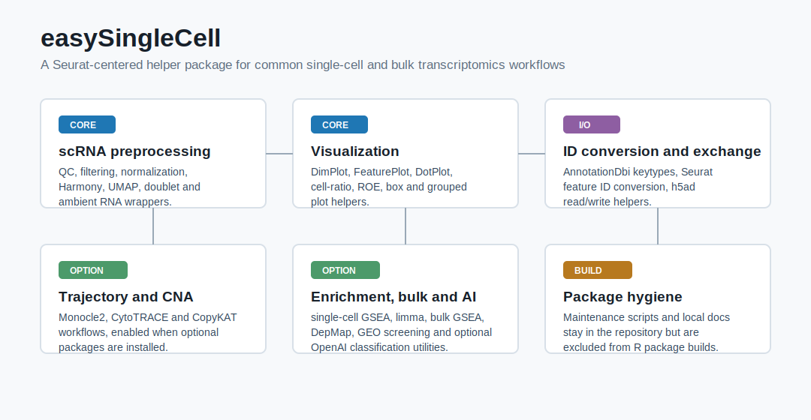
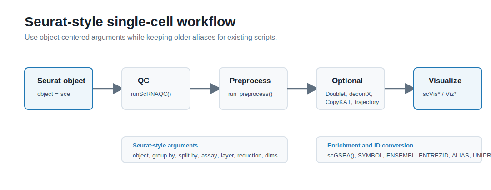

# easySingleCell

[](https://opensource.org/licenses/MIT)

`easySingleCell` is a Seurat-oriented R package for common single-cell, bulk transcriptomics, GEO metadata screening, DepMap visualization, gene ID conversion, and function-level model-assisted annotation workflows. The package keeps exported APIs focused on analysis helpers and does not provide an interactive AI chat assistant.



## Available Modules

| Module | Representative functions | Status | Notes |
| --- | --- | --- | --- |
| Project setup | `creat_project()` | Available | Creates a standard analysis project layout. |
| scRNA QC and preprocessing | `runScRNAQC()`, `run_preprocess()` | Available | Uses Seurat-style arguments such as `object =`, `group.by =`, `dims =`. |
| Doublet and contamination | `runDoubletFinderAnalysis()`, `run_decontX()` | Optional | Requires optional packages such as `DoubletFinder` or `celda`. |
| CNA, trajectory, stemness | `runCopyKAT()`, `runMonocleAnalysis()`, `runCytoTRACEAnalysis()` | Optional | Depends on external tools or optional R packages. |
| Single-cell visualization | `scVisDimPlot()`, `scVisFeaturePlot()`, `scVisDotPlot()`, `scVisVlnPlot()` | Available | Wrappers around Seurat metadata and ggplot2 workflows. |
| Cell composition | `scVisCellRatio()`, `scVisRatioBox()`, `scVisCellFC()`, `scVisRoePlot()` | Available or optional | Ro/e symbols are centered on Ro/e = 1. |
| Single-cell enrichment | `scGSEA()` | Available | Runs Seurat-style `FindMarkers()` plus preranked GO GSEA. |
| Cell type annotation | `AutoCellType()` | Requires API | LLM-assisted annotation from marker genes. |
| Bulk analysis | `BulkLimma()`, `BulkGseGO()` | Available | Designed for cleaned genes x samples expression matrices. |
| GEO and DepMap AI helpers | `GEO_Classify_AI()`, `GEO_Screen_AI()`, `DepmapMetaSelect()` | Requires API | Uses OpenAI-compatible APIs for semantic classification or selection. |
| DepMap plotting | `DepmapPrepare()`, `DepmapBox()`, `DepmapScatter()` | Available | Uses local DepMap CSV files or processed RData. |
| ID conversion | `convert_id()`, `convert_sce_id()` | Available | Supports OrgDb keytypes beyond Ensembl/Symbol, including ENTREZID, ALIAS, UNIPROT, and REFSEQ where available. |
| h5ad exchange | `readH5AD()`, `writeH5AD()` | Optional | Requires `reticulate` and a compatible Python/AnnData environment. |

## Workflow Vignettes

The `vignettes/` folder is part of the formal R package source. The `.Rmd`
files are installed as package vignettes, and the `.md` files are kept as
source-tree reading copies.

- [SingleCell_Workflow.Rmd](vignettes/SingleCell_Workflow.Rmd)
- [Bulk_GEO_DepMap_Workflow.Rmd](vignettes/Bulk_GEO_DepMap_Workflow.Rmd)



## Installation

Install from a local source checkout:

```r
install.packages("E:/codex/bio_project/easySingleCell-main", repos = NULL, type = "source")
```

Install from GitHub:

```r
if (!requireNamespace("remotes", quietly = TRUE)) {
  install.packages("remotes")
}

remotes::install_github(
  "BioinfoXP/easySingleCell",
  upgrade = FALSE,
  dependencies = TRUE
)
```

Core dependencies commonly needed in analysis projects:

```r
if (!requireNamespace("BiocManager", quietly = TRUE)) {
  install.packages("BiocManager")
}

BiocManager::install(c(
  "AnnotationDbi",
  "org.Hs.eg.db",
  "clusterProfiler"
))

install.packages(c(
  "Seurat",
  "ggplot2",
  "dplyr",
  "tidyr",
  "tibble",
  "patchwork",
  "harmony"
))
```

Optional dependencies:

```r
# Ambient RNA contamination
BiocManager::install("celda")

# Mouse/rat ID conversion and scGSEA
BiocManager::install(c("org.Mm.eg.db", "org.Rn.eg.db"))

# CopyKAT / DoubletFinder are best installed in a project-specific environment.
# remotes::install_github("navinlabcode/copykat")
# remotes::install_github("chris-mcginnis-ucsf/DoubletFinder")
```

## AI API Settings

Only function-level AI helpers are kept:

- `AutoCellType()`
- `GEO_Classify_AI()`
- `GEO_Screen_AI()`
- `DepmapMetaSelect()`

These helpers use an internal OpenAI-compatible provider dispatcher. They do not read or write a persistent package config file. Resolution is simple:

- `api_key = NULL` reads `OPENAI_API_KEY`.
- `model = NULL` uses the package default in `R/AI_config.R`.
- `base_url = NULL` uses the package default in `R/AI_config.R`.
- `endpoint = NULL` uses `auto`; `auto` routes between chat completions and Responses API endpoints when needed.

Example:

```r
Sys.setenv(OPENAI_API_KEY = "sk-...")

celltype_res <- AutoCellType(
  input = markers,
  tissuename = "Human liver tumor",
  api_key = Sys.getenv("OPENAI_API_KEY"),
  base_url = "https://api.gpt.ge/v1",
  endpoint = "auto"
)
```

For a Responses API endpoint, either pass a base URL ending in `/v1` with `endpoint = "responses"`, or pass a URL ending in `/v1/responses`.

```r
selected_geo <- GEO_Screen_AI(
  input_data = geo_metadata,
  disease = "pancreatic cancer",
  data_type = "Bulk RNA-seq",
  target_species = "Homo sapiens",
  api_key = Sys.getenv("OPENAI_API_KEY"),
  base_url = "https://your-provider.example/v1/responses",
  endpoint = "auto"
)
```

## Single-cell Quick Start

```r
library(easySingleCell)
library(Seurat)

sce <- runScRNAQC(
  object = sce,
  minGene = 200,
  maxGene = 6000,
  pctMT = 20,
  maxCounts = 20000,
  species = "human"
)

sce <- run_preprocess(
  object = sce,
  dims = 1:30,
  group.by = "orig.ident",
  n_features = 3000
)
```

## Cell Proportion and Ro/e

`scVisRoePlot()` computes observed/expected ratio. Ro/e is centered on `1`: `+`, `++`, and `+++` indicate increasing enrichment; blank labels indicate values close to expectation; `-`, `--`, and `---` indicate increasing depletion. `display.mode = "numeric"` prints two-decimal values directly.

```r
p_roe <- scVisRoePlot(
  sce = sce,
  group.by = "group",
  cell.type = "celltype",
  sample.by = "sample",
  display.mode = "symbol",
  font.size.row = 9,
  font.size.col = 9
)

print(p_roe)
roe_mat <- attr(p_roe, "roe_mat")
```

## Single-cell GSEA

`scGSEA()` follows Seurat differential-expression style: it can call `FindMarkers()` internally and then run `clusterProfiler::gseGO()` on a preranked marker table.

```r
gsea_epithelial <- scGSEA(
  object = sce,
  ident.1 = "Tumor",
  ident.2 = "Normal",
  group.by = "group",
  species = "human",
  ont = "BP",
  key_type = "SYMBOL"
)

head(gsea_epithelial$gsea)
head(gsea_epithelial$markers)
```

Reuse an existing marker table:

```r
markers <- FindMarkers(
  object = sce,
  ident.1 = "Tumor",
  ident.2 = "Normal",
  group.by = "group",
  logfc.threshold = 0
)

gsea_bp <- scGSEA(
  markers = markers,
  species = "human",
  ont = "BP",
  key_type = "SYMBOL"
)
```

## Bulk Quick Start

```r
deg <- BulkLimma(
  exp_mat = exp_mat,
  metadata = metadata,
  group_col = "condition",
  case_group = "Tumor",
  control_group = "Normal",
  p_cutoff = 0.05,
  logfc_cutoff = 1
)

gene_rank <- stats::setNames(deg$logFC, deg$symbol)
gse_bp <- BulkGseGO(gene_rank = gene_rank, ont = "BP", key_type = "SYMBOL")
```

## ID Conversion

`convert_id()` is based on `AnnotationDbi::mapIds()` and supports keytypes provided by the selected OrgDb. It is not limited to Ensembl/Symbol conversion.

```r
convert_id(
  features = c("TP53", "EGFR"),
  species = "human",
  from_type = "symbol",
  to_type = "uniprot"
)
```

Cross-species conversion currently uses gene symbols as a quick bridge. Use a dedicated ortholog database for formal ortholog analysis.

## Maintenance Entry Points

Future package updates should start with these files:

- `R/AI_config.R`: default `OPENAI_API_KEY` environment variable, model, `base_url`, endpoint, and provider routing.
- `R/AI_provider.R`: OpenAI-compatible chat completions and Responses API request handling.
- `R/AutoCellType.R`, `R/GEO_Index.R`, `R/Depmap.R`: user-facing model-assisted helper functions.
- `vignettes/SingleCell_Workflow.Rmd` and `vignettes/Bulk_GEO_DepMap_Workflow.Rmd`: formal package vignettes.
- `tests/testthat/test-ai-config.R`, `tests/testthat/test-ai-dispatcher.R`, `tests/testthat/test-scGSEA.R`, and `tests/testthat/test-package-hygiene.R`: provider routing, AI helper dispatch, enrichment, and package hygiene tests.

Retained but excluded from formal R package builds:

- `gitpush.sh`: release/push script retained by request.
- `docs/`, `tools/`: maintenance notes and checks.
- `easySingleCell.Rproj`, `.gitignore`: development environment files.

## Verification

In WSL or Linux R from the package root:

```r
pkgload::load_all(quiet = TRUE)
testthat::test_dir("tests/testthat", reporter = "summary")
```

Installed smoke testing:

```r
library(easySingleCell)
packageVersion("easySingleCell")
stopifnot("scGSEA" %in% getNamespaceExports("easySingleCell"))
stopifnot(!("easyAI" %in% getNamespaceExports("easySingleCell")))
```
