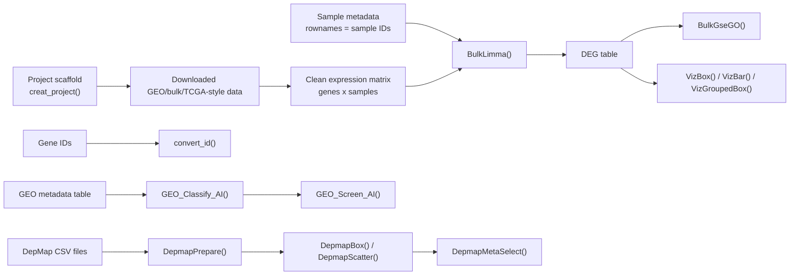

# Bulk / GEO / DepMap Workflow

This vignette is a local workflow note for bulk RNA-seq expression matrices,
GEO metadata screening, and DepMap visualization with the current
`easySingleCell` package.

The current package does not export dedicated TCGA download, survival-analysis,
or clinical-stage plotting wrappers. Use this workflow for TCGA-style or other
bulk data that has already been downloaded and cleaned into expression matrices
plus metadata.

## Workflow Overview



## Function Map

| Step | Function | Purpose |
| --- | --- | --- |
| Project setup | `creat_project()` | Create a standard project folder for scripts, data, and outputs. |
| Bulk DEG | `BulkLimma()` | Differential expression from a normalized genes x samples matrix. |
| Preranked GO GSEA | `BulkGseGO()` | Run preranked GO GSEA on a named ranked gene vector. |
| Gene ID conversion | `convert_id()` | Convert IDs across OrgDb keytypes such as SYMBOL, ENSEMBL, ENTREZID, UNIPROT, ALIAS, and REFSEQ. |
| Generic boxplot | `VizBox()` | Publication-style boxplot with optional pairwise comparisons. |
| Generic barplot | `VizBar()` | Mean barplot with SD/SE error bars and optional comparisons. |
| Grouped boxplot | `VizGroupedBox()` | Compare two groups within each gene or category. |
| GEO classification | `GEO_Classify_AI()` | Use an LLM to classify GEO metadata into scRNA-seq, stRNA-seq, Bulk RNA-seq, Microarray, or Other. |
| GEO screening | `GEO_Screen_AI()` | Use an LLM to screen GEO metadata by disease, data type, species, and custom requirements. |
| DepMap preparation | `DepmapPrepare()` | Process DepMap CSV files into a reusable RData file. |
| DepMap plotting | `DepmapBox()`, `DepmapScatter()` | Plot gene effect/dependency and expression-effect correlation. |
| DepMap AI select | `DepmapMetaSelect()` | Use an LLM to select cell lines from DepMap metadata. |

## Project Setup

```r
library(easySingleCell)

creat_project(
  ProjectName = "bulk_geo_depmap_project",
  BasePath = "."
)
```

The package does not download TCGA/GEO expression data. Put downloaded and
cleaned expression matrices, metadata, and result files into the project
folders created above.

## AI API Settings

Function-level AI helpers use OpenAI-compatible APIs:

- `GEO_Classify_AI()`
- `GEO_Screen_AI()`
- `DepmapMetaSelect()`

Keep credentials outside the script when possible:

```r
ai_key <- Sys.getenv("OPENAI_API_KEY")
ai_base_url <- NULL
ai_endpoint <- "auto"
```

For model-backed helpers, `api_key = NULL` reads `OPENAI_API_KEY`.
`model = NULL`, `base_url = NULL`, and `endpoint = NULL` use package defaults
from `R/AI_config.R`. There is no persistent package config file and no
interactive assistant state.

Pass a custom URL only when your model provider requires it. The shared
provider dispatcher accepts chat-style `/v1` endpoints and Responses API
endpoints ending in `/v1/responses`:

```r
ai_base_url <- "https://api.gpt.ge/v1"
ai_endpoint <- "auto"
# ai_base_url <- "https://your-provider.example/v1/responses"
```

Bare API hosts such as `https://api.example.com` are normalized to
`https://api.example.com/v1`. A 401 response usually means the key does not
belong to the current `base_url` or is not authorized for the selected model.

## Input Contract

For `BulkLimma()`, prepare:

- `exp_mat`: normalized expression matrix with genes as rows and samples as
  columns, for example log2(TPM + 1).
- `metadata`: data frame with sample IDs as row names.
- `group_col`: metadata column defining the comparison.
- `case_group` and `control_group`: group labels that must exist in
  `metadata[[group_col]]`.

The function automatically keeps the shared samples between `colnames(exp_mat)`
and `rownames(metadata)`.

## Differential Expression

```r
library(easySingleCell)

# exp_mat: genes x samples normalized matrix, for example log2(TPM + 1)
# metadata: sample annotations; rownames(metadata) must be sample IDs

metadata$condition <- factor(
  metadata$condition,
  levels = c("Normal", "Tumor")
)

deg <- BulkLimma(
  exp_mat = exp_mat,
  metadata = metadata,
  group_col = "condition",
  case_group = "Tumor",
  control_group = "Normal",
  adj_method = "BH",
  p_cutoff = 0.05,
  logfc_cutoff = 1
)

head(deg)
table(deg$change)
```

For a TCGA-style tumor-vs-normal comparison, create the `condition` column from
your cleaned sample annotation before calling `BulkLimma()`.

## Gene ID Conversion

`convert_id()` is not limited to Symbol/Ensembl conversion. It works with the
keytypes provided by the selected organism database.

```r
id_map <- convert_id(
  features = deg$symbol,
  species = "human",
  from_type = "symbol",
  to_type = "entrezid",
  keep_unmapped = FALSE
)

head(id_map)
```

Other common conversions:

```r
symbol_to_uniprot <- convert_id(
  features = c("TP53", "EGFR"),
  species = "human",
  from_type = "symbol",
  to_type = "uniprot"
)

entrez_to_symbol <- convert_id(
  features = c("7157", "1956"),
  species = "human",
  from_type = "entrezid",
  to_type = "symbol"
)
```

## Preranked GO GSEA

`BulkGseGO()` expects a named numeric vector sorted by a ranking statistic such
as log fold change. The function sorts again internally for safety.

```r
gene_rank <- deg$logFC
names(gene_rank) <- deg$symbol
gene_rank <- gene_rank[is.finite(gene_rank)]

gse_bp <- BulkGseGO(
  gene_rank = gene_rank,
  ont = "BP",
  key_type = "SYMBOL",
  p_cutoff = 0.05,
  min_size = 10,
  max_size = 500,
  seed = 123
)
```

If your rank names are Entrez IDs, set `key_type = "ENTREZID"` and pass a
matching `org_db`.

## DEG Visualization

Prepare a long table for selected genes:

```r
genes <- c("EPCAM", "KRT19", "MKI67")

plot_df <- data.frame(
  sample = rep(colnames(exp_mat), each = length(genes)),
  gene = rep(genes, times = ncol(exp_mat)),
  expression = as.numeric(exp_mat[genes, , drop = FALSE]),
  stringsAsFactors = FALSE
)

plot_df$condition <- metadata[plot_df$sample, "condition"]
```

Boxplot:

```r
p_box <- VizBox(
  data = subset(plot_df, gene == "EPCAM"),
  x_col = "condition",
  y_col = "expression",
  comparisons = c("Normal", "Tumor"),
  test_method = "wilcox.test",
  title = "EPCAM expression"
)

print(p_box)
```

Barplot:

```r
p_bar <- VizBar(
  data = subset(plot_df, gene == "EPCAM"),
  x_col = "condition",
  y_col = "expression",
  comparisons = c("Normal", "Tumor"),
  error_type = "se",
  title = "EPCAM expression"
)

print(p_bar)
```

Grouped boxplot:

```r
p_grouped <- VizGroupedBox(
  data = plot_df,
  x_col = "gene",
  y_col = "expression",
  group_col = "condition",
  test_method = "wilcox.test",
  p_adjust_method = "BH",
  legend.position = "right"
)

print(p_grouped)
```

Save a figure:

```r
ggplot2::ggsave(
  filename = "./figures/EPCAM_bulk_boxplot.pdf",
  plot = p_box,
  width = 5,
  height = 4,
  units = "in"
)
```

## GEO Metadata Screening

Use these functions when you have a GEO metadata table and want AI-assisted
classification or semantic filtering. These functions require an
OpenAI-compatible API key.

```r
classified_geo <- GEO_Classify_AI(
  input_data = geo_metadata,
  batch_size = 50,
  api_key = ai_key,
  base_url = ai_base_url,
  endpoint = ai_endpoint
)

table(classified_geo$AI_SeqType)
```

Screen the classified table:

```r
selected_geo <- GEO_Screen_AI(
  input_data = classified_geo,
  disease = "pancreatic cancer",
  data_type = "Bulk RNA-seq",
  target_species = "Homo sapiens",
  other_req = "exclude cell lines",
  api_key = ai_key,
  base_url = ai_base_url,
  endpoint = ai_endpoint
)
```

## DepMap Workflow

Place the required DepMap CSV files in `./Depmap`, then process them once.

```r
DepmapPrepare(
  data_dir = "./Depmap",
  force_process = FALSE
)
```

Plot CRISPR gene effect or dependency:

```r
p_depmap <- DepmapBox(
  genes = c("KRAS", "TP53"),
  rdata_path = "./Depmap/DepMap_Processed.Rdata",
  data_type = "effect",
  cell_filter = OncotreeLineage == "Lung"
)

print(p_depmap)
```

Expression-effect correlation:

```r
p_scatter <- DepmapScatter(
  genes = "KRAS",
  rdata_path = "./Depmap/DepMap_Processed.Rdata",
  data_type = "effect",
  cell_filter = OncotreeLineage == "Lung",
  cor_method = "pearson"
)

print(p_scatter)
```

AI-assisted metadata selection:

```r
selected_ids <- DepmapMetaSelect(
  query = "lung adenocarcinoma",
  col_name = "OncotreePrimaryDisease",
  rdata_path = "./Depmap/DepMap_Processed.Rdata",
  api_key = ai_key,
  base_url = ai_base_url,
  endpoint = ai_endpoint
)

DepmapBox(
  genes = "KRAS",
  subset_ids = selected_ids,
  rdata_path = "./Depmap/DepMap_Processed.Rdata"
)
```
