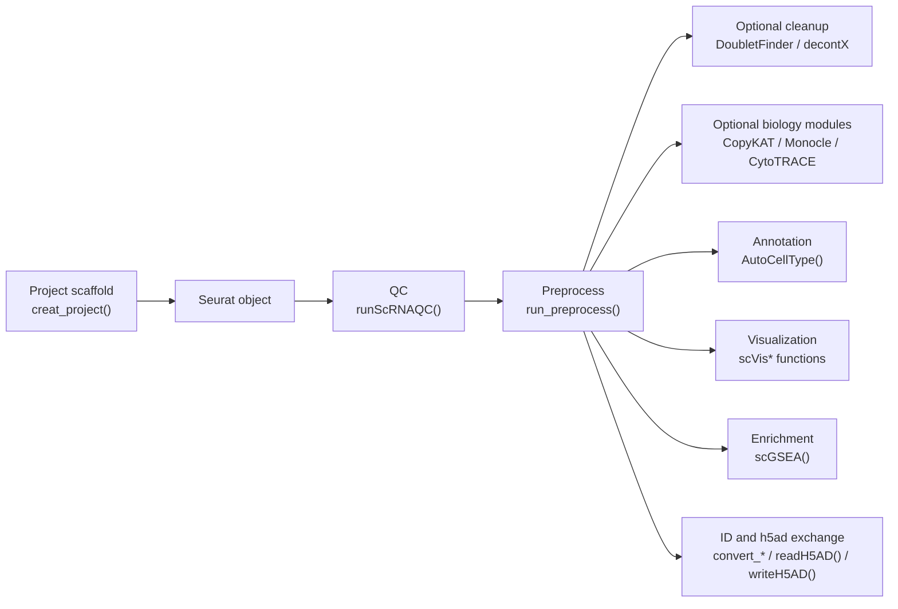

---
title: "Single-cell Workflow"
output: rmarkdown::html_vignette
vignette: >
  %\VignetteIndexEntry{Single-cell Workflow}
  %\VignetteEngine{knitr::rmarkdown}
  %\VignetteEncoding{UTF-8}
---

```{r, include = FALSE}
knitr::opts_chunk$set(
  collapse = TRUE,
  comment = "#>",
  eval = FALSE,
  purl = FALSE
)
```

`easySingleCell` provides Seurat-oriented wrappers for common single-cell
workflows. This vignette is intentionally code-first: replace placeholder
objects such as `sce`, `markers`, and metadata columns with your project data.

## Workflow Overview



## Function Map

| Step | Function | Purpose |
| --- | --- | --- |
| Project setup | `creat_project()` | Create a standard project folder for scripts, data, and outputs. |
| QC | `runScRNAQC()` | Filter a Seurat object by gene count, UMI count, and mitochondrial percentage. |
| Preprocess | `run_preprocess()` | Normalize, scale, run PCA/Harmony, neighbors, and UMAP. |
| Annotation | `AutoCellType()` | LLM-assisted cell type annotation from marker genes. |
| Visualization | `scVisDimPlot()`, `scVisFeaturePlot()`, `scVisDotPlot()`, `scVisVlnPlot()` | Seurat-oriented plotting wrappers. |
| Enrichment | `scGSEA()` | Run GO GSEA from Seurat `FindMarkers()` or an existing marker table. |
| Cell proportions | `scVisCellRatio()`, `scVisRatioBox()`, `scVisCellFC()`, `scVisRoePlot()` | Cell composition, proportion comparison, fold-change, and Ro/e enrichment plots. |
| ID conversion | `convert_id()`, `convert_sce_id()` | Convert vectors or Seurat feature IDs with AnnotationDbi keytypes. |
| h5ad exchange | `readH5AD()`, `writeH5AD()` | Convert between AnnData/h5ad and Seurat. |

## Project Setup

```r
library(easySingleCell)

creat_project(
  ProjectName = "HCC_single_cell",
  BasePath = "."
)
```

## AI API Settings

Only function-level AI helpers are kept in the package. In a single-cell
workflow this mainly means `AutoCellType()`.

```r
ai_key <- Sys.getenv("OPENAI_API_KEY")
ai_base_url <- NULL
ai_endpoint <- "auto"
```

For model-backed helpers, `api_key = NULL` reads `OPENAI_API_KEY`.
`model = NULL`, `base_url = NULL`, and `endpoint = NULL` use package defaults
from `R/AI_config.R`. There is no persistent package config file and no
interactive AI assistant state.

## Minimal Seurat Workflow

```r
library(easySingleCell)
library(Seurat)

# counts <- Read10X("data/raw/10x_matrix")
# sce <- CreateSeuratObject(counts = counts, project = "HCC")

sce <- runScRNAQC(
  object = sce,
  minGene = 200,
  maxGene = 6000,
  pctMT = 20,
  maxCounts = 20000,
  species = "human"
)

sce <- run_preprocess(
  object = sce,
  dims = 1:30,
  group.by = "orig.ident",
  n_features = 3000
)
```

Use `object =` for Seurat-style calls. `group.by` should be a metadata column
used for Harmony batch correction, such as `orig.ident`, `sample`, or `batch`.

## Optional Single-cell Modules

These modules depend on optional packages. Install them only when the project
needs the corresponding analysis.

```r
sce <- runDoubletFinderAnalysis(
  object = sce,
  split.by = "orig.ident",
  pcs = 1:15,
  ncores = 4,
  sct = FALSE
)

sce <- run_decontX(
  object = sce,
  assay = "RNA",
  seed = 123
)

sce <- runCopyKAT(
  object = sce,
  target_class = "Epithelial",
  ref_classes = c("T cell", "B cell", "Endothelial"),
  sample.by = "orig.ident",
  group.by = "celltype",
  ref_mode = "sample",
  n.cores = 4
)
```

## Cell Type Annotation

`AutoCellType()` accepts either a Seurat marker-result data frame or a named
marker list. It requires an OpenAI-compatible API key.

```r
markers <- FindAllMarkers(
  object = sce,
  only.pos = TRUE,
  min.pct = 0.25,
  logfc.threshold = 0.25
)

celltype_res <- AutoCellType(
  input = markers,
  tissuename = "Human liver tumor",
  topgenenumber = 20,
  p_val_thresh = 0.05,
  n_cores = 1,
  api_key = ai_key,
  base_url = ai_base_url,
  endpoint = ai_endpoint
)
```

## Single-cell GSEA

`scGSEA()` follows the Seurat comparison style. It can run
`Seurat::FindMarkers()` internally and then pass the ranked marker table to
`clusterProfiler::gseGO()`.

```r
gsea_group <- scGSEA(
  object = sce,
  ident.1 = "Tumor",
  ident.2 = "Normal",
  group.by = "group",
  species = "human",
  ont = "BP",
  key_type = "SYMBOL",
  logfc.threshold = 0
)

head(gsea_group$gsea)
head(gsea_group$gene_rank)
```

Reuse an existing marker table when available:

```r
markers_group <- FindMarkers(
  object = sce,
  ident.1 = "Tumor",
  ident.2 = "Normal",
  group.by = "group",
  logfc.threshold = 0
)

gsea_group <- scGSEA(
  markers = markers_group,
  species = "human",
  ont = "BP",
  key_type = "SYMBOL"
)
```

## Visualization

```r
p_dim <- scVisDimPlot(
  scRNA = sce,
  reduction = "umap",
  group.by = "celltype",
  label = TRUE,
  repel = TRUE
)

p_feature <- scVisFeaturePlot(
  scRNA = sce,
  features = c("EPCAM", "KRT19"),
  reduction = "umap"
)

p_dot <- scVisDotPlot(
  object = sce,
  features = list(
    Epithelial = c("EPCAM", "KRT19"),
    T_cell = c("CD3D", "CD3E")
  ),
  group.by = "celltype"
)

p_vln <- scVisVlnPlot(
  sce = sce,
  features = "EPCAM",
  group.by = "group",
  auto_compare = TRUE,
  assay = "RNA",
  layer = "data"
)
```

## Cell Proportion and Ro/e

```r
p_ratio <- scVisCellRatio(
  sce = sce,
  group_col = "group",
  celltype_col = "celltype",
  group_order = c("Normal", "Tumor")
)

p_roe <- scVisRoePlot(
  sce = sce,
  group.by = "group",
  cell.type = "celltype",
  sample.by = "sample",
  display.mode = "symbol",
  font.size.row = 9,
  font.size.col = 9
)

roe_mat <- attr(p_roe, "roe_mat")
```

`display.mode = "symbol"` uses Ro/e = 1 as the expected-abundance center:
`+`, `++`, and `+++` indicate enrichment, blank labels indicate values close
to expectation, and `-`, `--`, and `---` indicate depletion.

## Gene ID Conversion

`convert_id()` is not limited to Ensembl/Symbol conversion. It supports
keytypes available in the chosen OrgDb, such as `SYMBOL`, `ENSEMBL`,
`ENTREZID`, `UNIPROT`, `ALIAS`, and `REFSEQ`.

```r
id_map <- convert_id(
  features = c("TP53", "EGFR"),
  species = "human",
  from_type = "symbol",
  to_type = "ensembl"
)

sce_ensembl <- convert_sce_id(
  object = sce,
  assay = "RNA",
  layer = "counts",
  species = "human",
  from_type = "symbol",
  to_type = "ensembl"
)
```

Cross-species conversion currently uses symbol names as a bridge. Treat it as a
quick exploratory helper; use a dedicated ortholog database for formal ortholog
analysis.

## H5AD Exchange

```r
sce <- readH5AD("input.h5ad")
writeH5AD(sce, "output.h5ad")
```

These functions require a compatible `reticulate` and Python/AnnData
environment.
