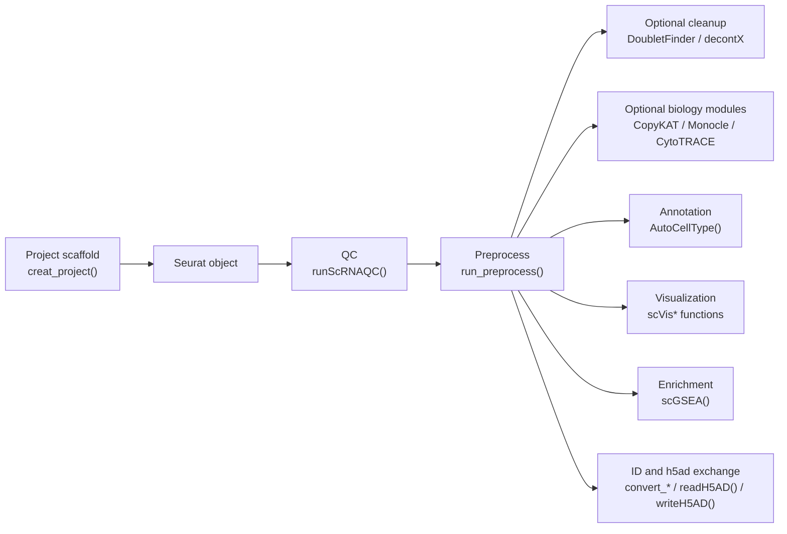

# Single-cell Workflow

This vignette is a local workflow note for the current `easySingleCell` R
package. It only uses functions exported by the package today. The `vignettes/`
directory is excluded from formal package builds by `.Rbuildignore`, so this
file is a practical reference rather than an installed HTML vignette.

## Workflow Overview



## Function Map

| Step | Function | Purpose |
| --- | --- | --- |
| Project setup | `creat_project()` | Create a standard project folder for scripts, data, and outputs. |
| QC | `runScRNAQC()` | Filter a Seurat object by gene count, UMI count, and mitochondrial percentage. |
| Preprocess | `run_preprocess()` | Normalize, scale, run PCA/Harmony, neighbors, and UMAP. |
| Doublet | `runDoubletFinderAnalysis()` | Run DoubletFinder by sample. Requires `DoubletFinder`. |
| Ambient RNA | `run_decontX()` | Run DecontX correction. Requires `celda`. |
| CNA | `runCopyKAT()` | Run CopyKAT CNA inference. Requires `copykat`. |
| Trajectory | `runMonocleAnalysis()` | Run Monocle trajectory workflow. Requires `monocle`. |
| Stemness | `runCytoTRACEAnalysis()` | Run CytoTRACE scoring. Requires `CytoTRACE`. |
| Annotation | `AutoCellType()` | LLM-assisted cell type annotation from marker genes. |
| Regulon AUC | `add_Umap_RAS()` | Add SCENIC/regulon AUC scores as a Seurat assay and UMAP reduction. |
| Visualization | `scVisDimPlot()`, `scVisFeaturePlot()`, `scVisDotPlot()`, `scVisVlnPlot()` | Seurat-oriented plotting wrappers. |
| Enrichment | `scGSEA()` | Run GO GSEA from Seurat `FindMarkers()` or an existing marker table. |
| Cell proportions | `scVisCellRatio()`, `scVisRatioBox()`, `scVisCellFC()`, `scVisRoePlot()` | Cell composition, proportion comparison, fold-change, and Ro/e enrichment plots. |
| ID conversion | `convert_id()`, `convert_sce_id()` | Convert vectors or Seurat feature IDs with AnnotationDbi keytypes. |
| h5ad exchange | `readH5AD()`, `writeH5AD()` | Convert between AnnData/h5ad and Seurat. |
| Palette | `Best100()` | Retrieve reusable color palettes for figures. |

## Project Setup

Start a new analysis folder when you want a clean place for scripts and
outputs.

```r
library(easySingleCell)

creat_project(
  ProjectName = "HCC_single_cell",
  BasePath = "."
)
```

The function creates folders and an RStudio project file. It does not download
data or run analysis.

## AI API Settings

Only function-level AI helpers are kept in the package. In a single-cell
workflow this mainly means `AutoCellType()`.

```r
ai_key <- Sys.getenv("OPENAI_API_KEY")
ai_base_url <- NULL
ai_endpoint <- "auto"
```

For model-backed helpers, `api_key = NULL` reads `OPENAI_API_KEY`.
`model = NULL`, `base_url = NULL`, and `endpoint = NULL` use the package
defaults in `R/AI_config.R`. There is no persistent package config file and no
interactive assistant state.

Pass a custom URL only when your provider requires it. The shared provider
dispatcher accepts chat-style `/v1` bases and Responses API endpoints ending in
`/v1/responses`:

```r
ai_base_url <- "https://api.gpt.ge/v1"
ai_endpoint <- "auto"
# ai_base_url <- "https://your-provider.example/v1/responses"
```

Bare API hosts such as `https://api.example.com` are normalized to
`https://api.example.com/v1`. A 401 response usually means the key does not
belong to the current `base_url` or is not authorized for the selected model.

## Minimal Seurat Workflow

```r
library(easySingleCell)
library(Seurat)

# Replace this with your own count matrix or loaded Seurat object.
# counts <- Read10X("data/raw/10x_matrix")
# sce <- CreateSeuratObject(counts = counts, project = "HCC")

sce <- runScRNAQC(
  object = sce,
  minGene = 200,
  maxGene = 6000,
  pctMT = 20,
  maxCounts = 20000,
  species = "human"
)

sce <- run_preprocess(
  object = sce,
  dims = 1:30,
  group.by = "orig.ident",
  n_features = 3000
)
```

Use `object =` for Seurat-style calls. `group.by` should be a metadata column
used for Harmony batch correction, such as `orig.ident`, `sample`, or `batch`.

## QC and Preprocessing

Human data:

```r
sce <- runScRNAQC(
  object = sce,
  species = "human",
  minGene = 200,
  maxGene = 6000,
  pctMT = 20,
  maxCounts = 20000
)
```

Mouse data:

```r
sce <- runScRNAQC(
  object = sce,
  species = "mouse",
  minGene = 200,
  maxGene = 6000,
  pctMT = 20,
  maxCounts = 20000
)
```

Custom mitochondrial gene pattern:

```r
sce <- runScRNAQC(
  object = sce,
  mt_pattern = "^MT-"
)
```

Preprocess after QC:

```r
sce <- run_preprocess(
  object = sce,
  dims = 1:30,
  group.by = "sample",
  n_features = 3000
)
```

## Optional Single-cell Modules

These modules depend on optional packages. Install them only when the project
needs the corresponding analysis.

### DoubletFinder

```r
sce <- runDoubletFinderAnalysis(
  object = sce,
  split.by = "orig.ident",
  pcs = 1:15,
  ncores = 4,
  sct = FALSE
)
```

### Ambient RNA Correction

```r
sce <- run_decontX(
  object = sce,
  assay = "RNA",
  seed = 123
)
```

### CopyKAT CNA Inference

```r
sce <- runCopyKAT(
  object = sce,
  target_class = "Epithelial",
  ref_classes = c("T cell", "B cell", "Endothelial"),
  sample.by = "orig.ident",
  group.by = "celltype",
  ref_mode = "sample",
  n.cores = 4
)
```

### Monocle Trajectory

```r
mono_res <- runMonocleAnalysis(
  object = sce,
  stratify_by = "celltype",
  downsample_n = 5000,
  cores = 4,
  save_path = "./output_data/monocle2.RData"
)
```

### CytoTRACE

```r
sce <- runCytoTRACEAnalysis(
  object = sce,
  group.by = "celltype",
  outdir = "./output_data/cytotrace",
  ncores = 4
)
```

## Cell Type Annotation

`AutoCellType()` accepts either a Seurat marker-result data frame or a named
marker list. It requires an OpenAI-compatible API key.

Data-frame input:

```r
markers <- FindAllMarkers(
  object = sce,
  only.pos = TRUE,
  min.pct = 0.25,
  logfc.threshold = 0.25
)

celltype_res <- AutoCellType(
  input = markers,
  tissuename = "Human liver tumor",
  topgenenumber = 20,
  p_val_thresh = 0.05,
  n_cores = 1,
  api_key = ai_key,
  base_url = ai_base_url,
  endpoint = ai_endpoint
)

celltype_res
```

Named-list input:

```r
marker_list <- list(
  Cluster0 = c("EPCAM", "KRT19", "KRT8"),
  Cluster1 = c("CD3D", "CD3E", "IL7R"),
  Cluster2 = c("MS4A1", "CD79A", "CD74")
)

celltype_res <- AutoCellType(
  input = marker_list,
  tissuename = "Human PBMC",
  prior_info = "Major immune and epithelial populations",
  api_key = ai_key,
  base_url = ai_base_url,
  endpoint = ai_endpoint
)
```

For sub-clustering, constrain the allowed labels:

```r
t_cell_labels <- c("CD8 naive", "CD8 effector", "CD8 exhausted", "Treg")

t_cell_res <- AutoCellType(
  input = markers,
  tissuename = "Human liver",
  cell_ontology = t_cell_labels,
  prior_info = "Sub-clustering of CD3-positive T cells",
  model = "gpt-4o",
  n_cores = 4,
  api_key = ai_key,
  base_url = ai_base_url,
  endpoint = ai_endpoint
)
```

## Single-cell GSEA

`scGSEA()` follows the Seurat comparison style. It can run
`Seurat::FindMarkers()` internally and then pass the ranked marker table to
`clusterProfiler::gseGO()`.

```r
gsea_group <- scGSEA(
  object = sce,
  ident.1 = "Tumor",
  ident.2 = "Normal",
  group.by = "group",
  species = "human",
  ont = "BP",
  key_type = "SYMBOL",
  logfc.threshold = 0
)

head(gsea_group$gsea)
head(gsea_group$gene_rank)
```

When a marker table already exists, reuse it to avoid repeated differential
expression:

```r
markers_group <- FindMarkers(
  object = sce,
  ident.1 = "Tumor",
  ident.2 = "Normal",
  group.by = "group",
  logfc.threshold = 0
)

gsea_group <- scGSEA(
  markers = markers_group,
  species = "human",
  ont = "BP",
  key_type = "SYMBOL"
)
```

For mouse or rat data, install the matching OrgDb package first or provide
`OrgDb =` directly.

## Visualization

### Dimension Reduction

```r
p_dim <- scVisDimPlot(
  scRNA = sce,
  reduction = "umap",
  group.by = "celltype",
  label = TRUE,
  repel = TRUE
)

print(p_dim)
```

Split dimension plots:

```r
p_split <- scVisDimSplit(
  sce = sce,
  group_col = "group",
  celltype_col = "celltype",
  reduction = "umap"
)

print(p_split)
```

### Feature Plot

```r
p_feature <- scVisFeaturePlot(
  scRNA = sce,
  features = c("EPCAM", "KRT19"),
  reduction = "umap"
)

print(p_feature)
```

### Dot Plot

```r
p_dot <- scVisDotPlot(
  object = sce,
  features = list(
    Epithelial = c("EPCAM", "KRT19"),
    T_cell = c("CD3D", "CD3E")
  ),
  group.by = "celltype"
)

print(p_dot)
```

### Violin Plot with Group Comparison

```r
p_vln <- scVisVlnPlot(
  sce = sce,
  features = "EPCAM",
  group.by = "group",
  auto_compare = TRUE,
  assay = "RNA",
  layer = "data"
)

print(p_vln)
```

Split by another metadata column:

```r
p_vln_split <- scVisVlnPlot(
  sce = sce,
  features = "EPCAM",
  group.by = "group",
  split.by = "celltype",
  auto_compare = TRUE,
  assay = "RNA",
  layer = "data"
)

print(p_vln_split)
```

Save a figure:

```r
ggplot2::ggsave(
  filename = "./figures/EPCAM_vln_group.pdf",
  plot = p_vln,
  width = 6,
  height = 4,
  units = "in"
)
```

### Cell Proportion Plots

Composition alluvial plot:

```r
p_ratio <- scVisCellRatio(
  sce = sce,
  group_col = "group",
  celltype_col = "celltype",
  group_order = c("Normal", "Tumor")
)

print(p_ratio)
```

Cell type proportion boxplot:

```r
p_ratio_box <- scVisRatioBox(
  sce = sce,
  group_col = "group",
  celltype_col = "celltype",
  sample_col = "sample"
)

print(p_ratio_box)
```

Cell type log2 fold-change:

```r
p_cell_fc <- scVisCellFC(
  sce = sce,
  group_col = "group",
  celltype_col = "celltype",
  comparisons = c("Tumor", "Normal")
)

print(p_cell_fc)
```

Ro/e enrichment heatmap:

```r
p_roe <- scVisRoePlot(
  sce = sce,
  group.by = "group",
  cell.type = "celltype",
  sample.by = "sample",
  display.mode = "symbol",
  font.size.row = 9,
  font.size.col = 9
)

print(p_roe)

roe_mat <- attr(p_roe, "roe_mat")
```

`display.mode = "symbol"` uses Ro/e = 1 as the expected-abundance center:
`+`, `++`, and `+++` indicate enrichment, blank labels indicate values close
to expectation, and `-`, `--`, and `---` indicate depletion. Use
`display.mode = "numeric"` to print two-decimal Ro/e values directly, or
`display.mode = "none"` to rely on color only.

## Regulon AUC / SCENIC Scores

If you already have SCENIC AUC scores, add them to the Seurat object and build
a regulon-space UMAP with `add_Umap_RAS()`.

```r
# auc_df can be regulons x cells or cells x regulons.
sce <- add_Umap_RAS(
  object = sce,
  auc_df = auc_df,
  reduction = "umap_ras",
  assay = "RAS",
  dims = 1:30
)

p_ras <- scVisDimPlot(
  scRNA = sce,
  reduction = "umap_ras",
  group.by = "celltype"
)
```

## Color Palettes

```r
pal <- Best100(palette_num = 1, n = 6)

p_dim <- scVisDimPlot(
  scRNA = sce,
  group.by = "celltype",
  colors = pal
)
```

## Gene ID Conversion

`convert_id()` is not limited to Ensembl/Symbol conversion. It supports
keytypes available in the chosen OrgDb, such as `SYMBOL`, `ENSEMBL`,
`ENTREZID`, `UNIPROT`, `ALIAS`, and `REFSEQ`.

```r
id_map <- convert_id(
  features = c("TP53", "EGFR"),
  species = "human",
  from_type = "symbol",
  to_type = "ensembl"
)

head(id_map)
```

Convert Seurat feature row names:

```r
sce_ensembl <- convert_sce_id(
  object = sce,
  assay = "RNA",
  layer = "counts",
  species = "human",
  from_type = "symbol",
  to_type = "ensembl"
)

head(sce_ensembl@misc$id_conversion$mapping)
```

Cross-species conversion currently uses symbol names as a bridge. Treat it as a
quick exploratory helper; use a dedicated ortholog database for formal ortholog
analysis.

## H5AD Exchange

```r
sce <- readH5AD("input.h5ad")
writeH5AD(sce, "output.h5ad")
```

These functions require a compatible `reticulate` and Python/AnnData
environment.
